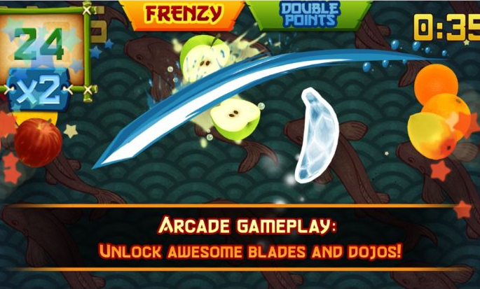
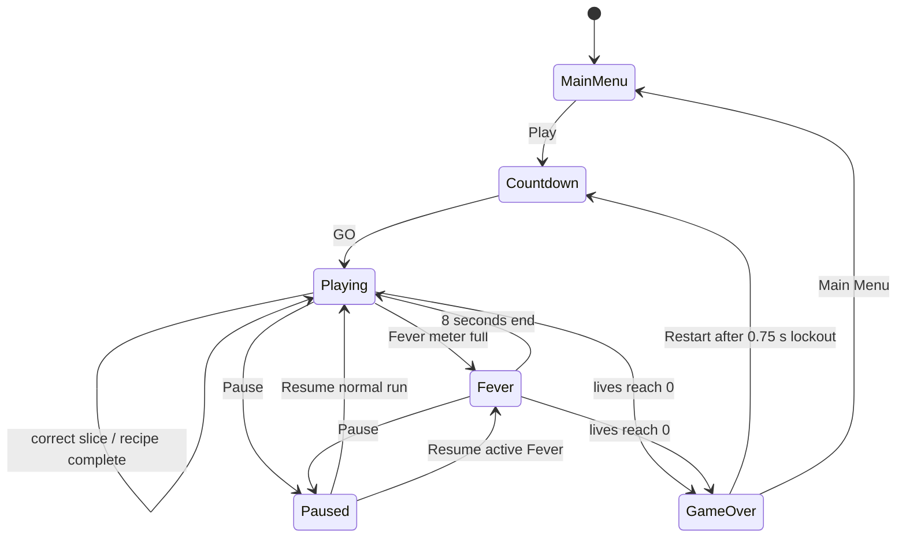
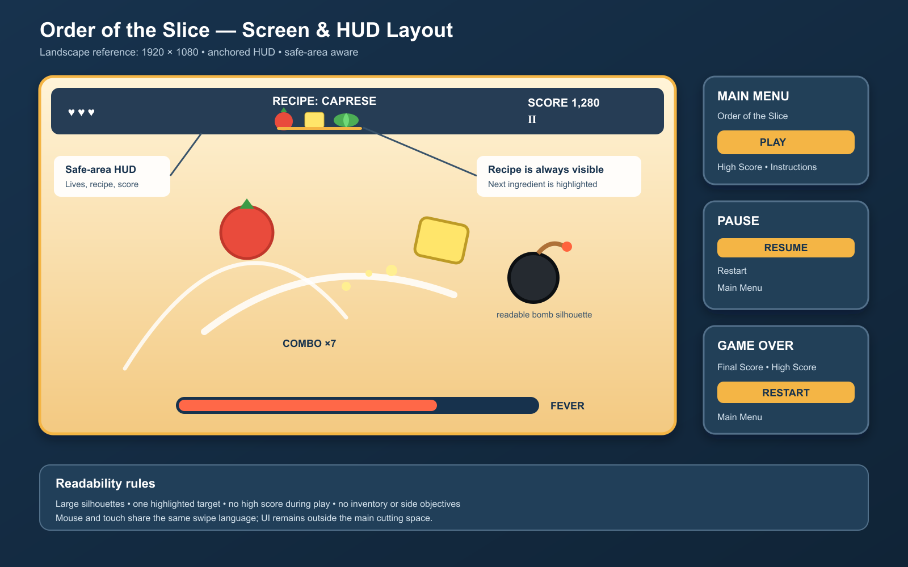
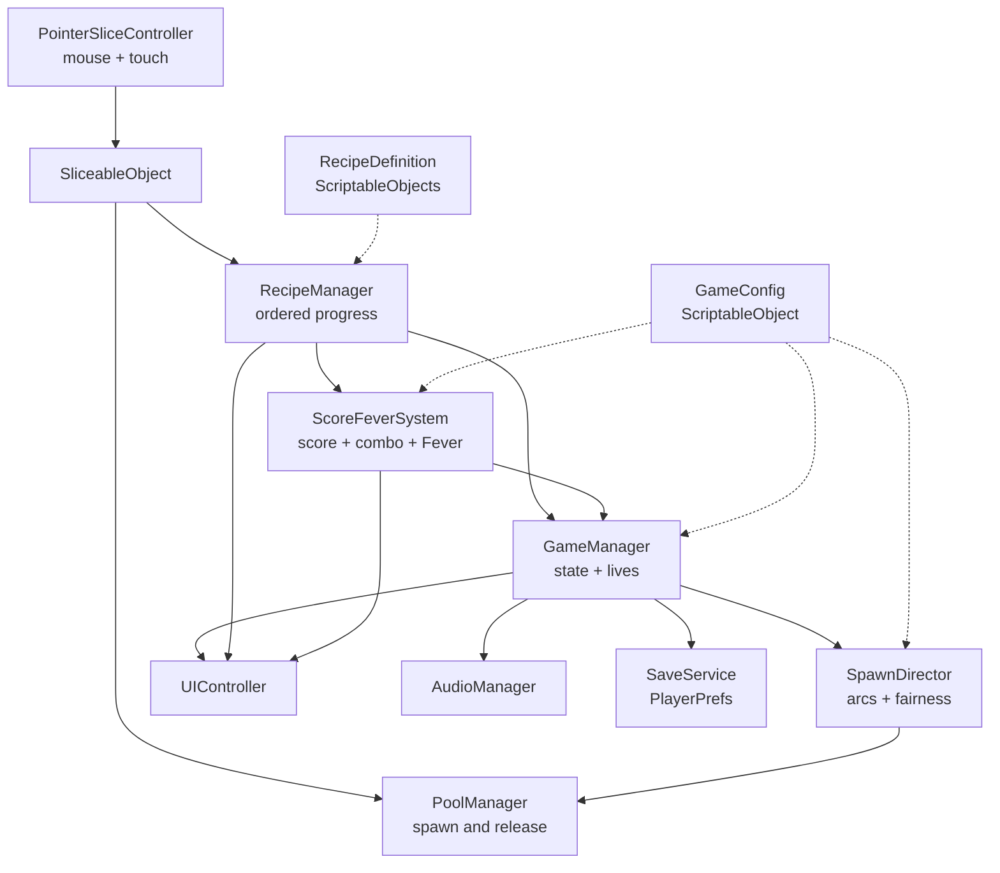

# Game Design Document — *Order of the Slice*

| | |
|---|---|
| **Working title** | *Order of the Slice* |
| **Team** | Bar Israelov — 316199579 (Core Gameplay, Architecture & Object Pooling) Linoy Kasuker — 208010751 (Recipe Systems, UI/UX & Visual Polish) Both (Programming, Game Design, Android Integration, Documentation & QA) |
| **Genre** | 2D arcade / recipe-sequencing / score-chaser |
| **Target platform** | Windows PC + Android APK |
| **Engine / Unity version** | Unity 6 (6000.3.20f1), URP 2D |
| **Orientation & reference resolution** | Landscape, 1920 × 1080 reference |
| **Expected session length** | 2–8 minutes |
| **Document version** | v0.2 — 2026-09-14 |

---

## 1. High Concept

*Order of the Slice* is a 2D arcade game for PC and Android. Players swipe through airborne ingredients to complete visible recipes in the correct order while avoiding wrong ingredients and bombs. Correct sequences build combos and charge an eight-second Fever mode. Three mistakes end the run, while faster throws and longer recipes steadily increase the challenge.

### Design pillars

1. **Recipe first** — every throw must support the active recipe. Random slicing is never the best strategy; unrelated collectibles and side systems are excluded.
2. **Fair at a glance** — the next ingredient and every hazard must be immediately readable. No impossible spawns, look-alike hazards, or screen-filling clutter.
3. **One gesture, maximum feedback** — dragging the mouse or one finger is the only gameplay action. Each successful slice should feel strong through sound, particles, motion, and clear UI response.

---

## 2. Reference & Inspiration

- **Primary reference:** [*Fruit Ninja Classic* by Halfbrick](https://www.halfbrick.com/games/fruit-ninja). Taking: swipe slicing, launched arcs, readable bombs, short score runs, and immediate feedback. Not taking: its branding, assets, characters, economy, modes, or rule of slicing every fruit.
- **Our direction:** the player is completing a visible recipe in a strict order. Recipe logic, fair required-ingredient spawning, combo tiers, and automatic Fever mode create the main decisions.
- **Video:** [official Fruit Ninja trailer — gameplay feel reference](https://www.youtube.com/watch?v=i56jtNZZzoQ&t=5s)

The image above is used only as a design reference. No Fruit Ninja visual or audio asset will be included in the game.

---

## 3. Core Game Loop

**Moment-to-moment rules**

- A run begins with three lives. The recipe card shows the full ingredient order and highlights the next target.
- The `SpawnDirector` launches pooled ingredients and bombs in readable arcs. The next required ingredient must appear within `maxRequiredWait`.
- Holding and dragging the left mouse button or one finger creates a cut. Fast pointer segments use `Physics2D.Linecast`; each object accepts one slice.
- A correct slice advances the recipe, increases the combo, scores points, and charges Fever. A wrong ingredient or bomb costs one life and resets the combo, while valid recipe progress remains.
- Recipe timeout costs one life, resets the combo, and replaces the recipe. Objects falling off-screen cause no penalty.
- Completion grants a bonus, then starts another recipe. The first three completed recipes have length 3, the next three length 4, and later recipes length 5.
- A full Fever meter activates automatically for 8 seconds, with faster spawns and double score. Normal order, hazard, and life rules still apply.
- At zero lives, spawning and slicing stop, objects are cleared, the high score is saved, and Game Over appears after about one second.

**Scoring**

- Correct ingredient: `10 × combo multiplier`.
- Recipe completion: `50 × recipe length`.
- Combo tiers: 0–4 = ×1, 5–9 = ×2, 10–14 = ×3, 15+ = ×4.
- Fever multiplies both ingredient points and completion bonuses by ×2.
- Only the best score is saved with `PlayerPrefs`.

### Parameters to tune

| Parameter | What it controls | First guess |
|---|---|---|
| `launchSpeedRange` | Minimum and maximum launch speed for an arc | 11–15 u/s |
| `spawnInterval` | Normal delay between throws | 0.85 s |
| `feverSpawnInterval` | Delay between throws during Fever | 0.55 s |
| `recipeTime` | Time allowed for one recipe | 14 s |
| `recipeLengthThresholds` | Completed recipes required to move from length 3 → 4 → 5 | 3 and 6 |
| `bombChance` | Chance that a throw is a bomb | 8% |
| `decoyChance` | Chance that an ingredient is not the next required one | 45% |
| `minimumSliceSpeed` | Minimum pointer speed that counts as a cut | 700 px/s |
| `maxRequiredWait` | Longest wait before the required ingredient must appear | 1.4 s |
| `feverDuration` | Length of Fever mode | 8 s |
| `feverScoreMultiplier` | Score multiplier during Fever | ×2 |
| `restartLockout` | Delay before Restart accepts input | 0.75 s |

**Where these live:** a `GameConfig` ScriptableObject. Ingredient sequences live in `RecipeDefinition` assets, so tuning requires no code change.

**Feel target:** within 45 seconds, a first-time player completes at least one three-ingredient recipe and can explain why a life was lost. After three minutes, the pressure is visibly higher without producing impossible throws.

---

## 4. Controls & Input

| Action | Keyboard / Mouse | Gamepad | Touch |
|---|---|---|---|
| Slice | Hold left mouse button and drag | Not supported | Hold one finger and drag |
| Select UI | Left click | Not supported | Tap |
| Pause / resume | `Esc` or Pause button | Not supported | Pause button; Android Back opens Pause |

- Unity's Input System reads one shared `Pointer` in `Update`. Consecutive positions are tested as line segments, so fast swipes cannot pass through thin objects.
- A gesture that begins over UI is ignored by the slicing system. UI selection is handled by the `EventSystem`.
- Slicing is enabled only in `Playing` and `Fever`. It is locked during menus, countdown, pause, transitions, and Game Over.
- Losing window focus or sending the Android app to the background pauses the game and clears the active swipe. The player must press Resume.
- Android Back opens Pause during play, resumes from Pause, returns to Main Menu from Game Over, and exits only from Main Menu.
- Game Over buttons remain locked for 0.75 seconds, preventing the final swipe from restarting the run.

---

## 5. Screens & UI

1. **Main Menu** — title, Play, saved high score, “Slice the recipe in order. Avoid bombs.”, and Quit on Windows only.
2. **Countdown** — gameplay remains visible behind `3–2–1–GO`; slicing and spawning unlock at `GO`.
3. **Gameplay HUD** — lives at top left; active recipe and highlighted next ingredient at top center; recipe timer below it; score and Pause at top right; combo near the action; Fever meter along the lower safe area.
4. **Pause** — dimmed gameplay with Resume, Restart, and Main Menu. Game time, recipe time, spawning, and slicing are frozen.
5. **Game Over** — final score, high score, optional “NEW HIGH SCORE”, Restart, and Main Menu.

- **Absent from the HUD:** high score, inventory, minimap, movement controls, currency, missions, and side objectives.
- **Canvas setup:** Screen Space – Overlay; `CanvasScaler` set to *Scale With Screen Size*, 1920 × 1080, match = 0.5. Important UI uses the safe area and anchors. Text uses TextMeshPro.

---

## 6. Art & Audio

The game uses a colourful cartoon kitchen style. Flat, readable sprites gain depth through scale, shadows, particles, short freezes, and camera movement.

| Asset | Variants / frames | Source & licence | Use |
|---|---|---|---|
| Ingredient sprites | 10 whole ingredients + two matching halves for each | Original team-created artwork; owned by the team | Play objects and sliced halves |
| Bomb and kitchen background | 1 bomb; 1 layered background | Original team-created artwork; owned by the team | Hazard and environment |
| UI panels and buttons | Selected pieces only | [Kenney UI Pack](https://kenney.nl/assets/ui-pack), CC0 | Menus and HUD framing |
| UI symbols | Heart, pause, sound, and navigation symbols | [Kenney Game Icons](https://kenney.nl/assets/game-icons), CC0 | Readable interface icons |
| Splats and particles | Four colour variants | [Kenney Splat Pack](https://kenney.nl/assets/splat-pack), CC0, recoloured by the team | Correct-slice VFX |
| UI sounds | Click, confirm, and cancel | [Kenney Interface Sounds](https://kenney.nl/assets/interface-sounds), CC0 | Menu feedback |
| Slice sounds | Several short variants | [8 Wet Squish, Slurp Impacts](https://opengameart.org/content/8-wet-squish-slurp-impacts), CC0 | Ingredient slices |
| Bomb sound | 1 short variant | [Dynamite Sound Effect](https://opengameart.org/content/dynamite-sound-effect), CC0 | Bomb hit |
| Music | Intro, gameplay loop, and short menu variation | [Empacotatron](https://opengameart.org/content/empacotatron), CC0 | Menu and gameplay music |

**Licence note:** the listed external assets are CC0 and may be modified and distributed; every source will still be credited. The Fruit Ninja screenshot is documentation-only and will not ship. No unlicensed, paid, or copied Fruit Ninja asset will be used.

**Technical art rules:** transparent PNG, 100 PPU, consistent outlines, maximum 2048-pixel textures, Android compression, and one Sprite Atlas if useful. Sorting: background → shadows → objects → halves → particles/trail → UI.

---

## 7. Technical Design

**Scenes:** `MainMenu.unity` and `Gameplay.unity`. Pause and Game Over are canvases inside Gameplay, so they do not require scene changes.

**Packages / systems used:** URP 2D Renderer, Input System, TextMeshPro, Physics2D, `UnityEngine.Pool.ObjectPool<T>`, Sprite Atlas, Particle System, and `PlayerPrefs`.

**Target devices:** Windows 10/11 PC at 1920 × 1080; Xiaomi Redmi Note 12S at 2400 × 1080 in Landscape (native panel: 1080 × 2400). The Android build targets 60 FPS and must not remain below 30 FPS during a full run. The installed Android version will be recorded during the first physical-device test.

**Architecture:**

| Script | Responsibility |
|---|---|
| `GameManager` | Owns state, lives, pause, restart, transitions, and Game Over. |
| `GameConfig` | Stores shared tuneable values in one ScriptableObject. |
| `RecipeDefinition` | Stores one ordered ingredient sequence and name. |
| `RecipeManager` | Chooses recipes and tracks the target index and timer. |
| `SpawnDirector` | Runs spawning, difficulty, and the fairness guarantee. |
| `PoolManager` | Owns typed pools and resets returned objects. |
| `PointerSliceController` | Reads mouse/touch, rejects UI gestures, and linecasts. |
| `SliceableObject` | Represents an ingredient or bomb and accepts one slice. |
| `ScoreFeverSystem` | Calculates score, combo, Fever charge, and timing. |
| `UIController` | Updates screens and HUD in response to game events. |
| `AudioManager` | Persists across scenes and plays music and SFX. |
| `SaveService` | Reads and writes the local high score. |

### Course features being implemented

1. **Object pooling** — reuses ingredients, bombs, halves, trails, and frequent effects to avoid garbage-collection spikes.
2. **Coroutines** — run spawning, countdown, recipe transitions, Fever, and Game Over delays without blocking frames.
3. **Singleton** — only `AudioManager` persists between scenes, preventing duplicate music and SFX services.
4. **ScriptableObjects** — `GameConfig` and `RecipeDefinition` keep tuning and recipe data outside runtime logic.
5. **Observer events** — gameplay publishes C# events; UI and audio subscribe and unsubscribe without controlling gameplay.
6. **State machine** — six named states decide exactly which systems may run.
7. **PlayerPrefs** — stores only the best local score.
8. **Mobile build** — shared pointer input, landscape safe-area UI, 60 FPS target, and physical Redmi Note 12S testing.

**External-code policy:** development starts in a new Unity 6000.3.20f1 project. The public-domain [Brackeys Fruit Ninja Replica](https://github.com/Brackeys/Fruit-Ninja-Replica) may guide the basic slice, launch, and split-object logic, which will be rewritten for the Input System, pooling, Android, and this architecture. Course projects guide the patterns. All reuse is credited, and the team must explain every submitted line.

---

## 8. Scope

### 8.1 MVP — the game is not a game without these

- [ ] Playable Windows build and Android APK using mouse and touch.
- [ ] Ten readable ingredients, each with a whole sprite and two prepared halves.
- [ ] At least nine recipes: three each of lengths 3, 4, and 5.
- [ ] Ordered recipe progress, highlighted next ingredient, recipe timer, and fair required-ingredient spawning.
- [ ] Wrong ingredients, bombs, three lives, Game Over, score, combo tiers, and automatic Fever.
- [ ] Increasing recipe length and spawn pressure using Inspector-configurable values.
- [ ] Main Menu, countdown, HUD, Pause, Game Over, restart flow, and saved high score.
- [ ] The listed course patterns used as described above.
- [ ] Responsive 1920 × 1080 UI with safe-area handling on the physical Android test device.
- [ ] Approved art, music, SFX, feedback, Credits, and a complete start-to-restart flow.

### 8.2 Polish — if the MVP is done and playable

- [ ] Smooth swipe trail, spinning prepared halves, coloured splats, and ingredient-specific particles.
- [ ] Small hit-stop, controlled camera shake, score pop-ups, sound variation, and UI animation.
- [ ] Recipe-complete celebration and a clear audiovisual Fever transformation.
- [ ] Directional-slice bonus, only after the full PC and Android MVP is stable.

### 8.3 Explicitly out of scope — we are **not** building these

- Multiplayer, networking, online leaderboards, accounts, or cloud saves.
- Shops, currency, advertisements, in-app purchases, unlock trees, or daily missions.
- Campaigns, level maps, multiple modes, boss fights, or narrative systems.
- Runtime mesh slicing; each ingredient uses prepared half sprites.
- Gamepad support, portrait mode, a 3D world, VR, custom knives, or playable characters.
- A save system beyond one local `PlayerPrefs` high score.

---

## Changelog

| Version | Date | Change |
|---|---|---|
| v0.1 | 2026-09-14 | Initial draft prepared for team review; no implementation started. |
| v0.2 | 2026-09-14 | Shortened wording, clarified Android Back behaviour, and replaced the reference image with official gameplay. |
